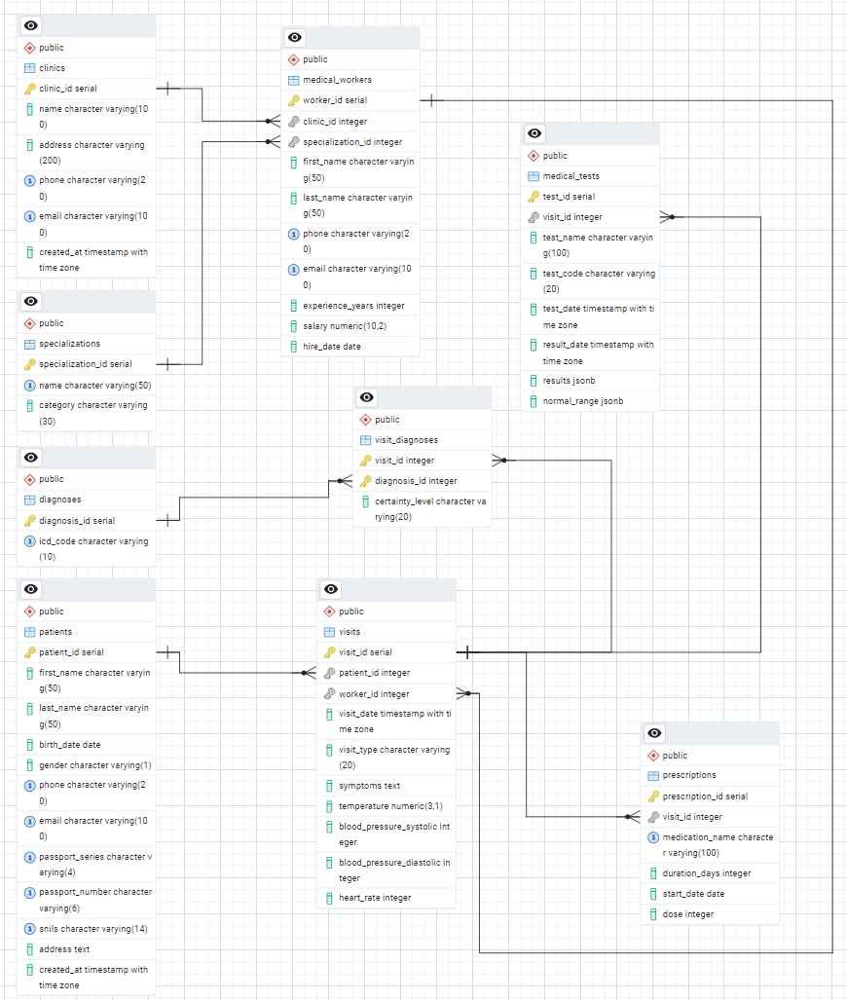

# Система для хранения данных о пациентах в мед. учреждениях с демонстрационными данными, запросами и анализом

## Описание базы данных
Схема данных состоит 9 таблиц. База данных хранит информацию о пациентах, мед.рабочих и посещениях, а также данные о медикаментозных назначениях и результатах анализов. Данные являются синтетическими(функции генерации в dump-файле)

### Основные таблицы
- **patients** - данные пациентов
- **medical_workers** - медицинский персонал  
- **visits** - записи о визитах
- **diagnoses** - диагнозы по МКБ-10
- **medical_tests** - медицинские анализы
- **prescriptions** - назначения лекарств
  
Связь между сущностями visits и diagnoses "многие ко многим" - информация о посещениях и диагнозах была вынесена в таблицу **visit_diagnoses**

## Быстрый старт

### Восстановление базы данных:
```bash
# Создать базу данных
createdb medical_database

# Восстановить из дампа
psql medical_database < database_dump.sql
```
## Технические особенности
### Индексы
Для оптимизации запросов были созданы индексы
```sql
-- Для быстрого поиска пациентов
CREATE INDEX idx_patients_phone ON patients(phone);

-- Для аналитических запросов по визитам
CREATE INDEX idx_visits_patient_date ON visits(patient_id, visit_date);
CREATE INDEX idx_visits_worker_date ON visits(worker_id, visit_date);

-- Для связей между таблицами
CREATE INDEX idx_tests_visit_id ON medical_tests(visit_id);
CREATE INDEX idx_prescriptions_visit_id ON prescriptions(visit_id);
```
### Триггер проверки пересечения визитов
```sql
-- Автоматическая проверка, что врач не занят в одно время(интервал 30 минут)
CREATE TRIGGER trg_check_visit_overlap
BEFORE INSERT OR UPDATE ON visits
FOR EACH ROW
EXECUTE FUNCTION check_visit_overlap();
```
## Графики о данных

## Запросы
### Средние и сложные запросы
```sql
-- Эффективность работы врачей по специализациям(3 самые эффективные)
SELECT 
    s.name as specialization,
    COUNT(DISTINCT mw.worker_id) as doctors_count,
    COUNT(v.visit_id) as total_visits,
    ROUND(AVG(mw.experience_years), 1) as avg_experience --средний опыт работы
FROM medical_workers mw
JOIN specializations s ON mw.specialization_id = s.specialization_id
LEFT JOIN visits v ON mw.worker_id = v.worker_id
GROUP BY s.specialization_id, s.name
ORDER BY total_visits DESC
LIMIT 3;
```
| specialization | doctors_count | total_visits | avg_experience |
|----------------|---------------|--------------|----------------|
| Orthopedics | 16 | 128 | 20.8 |
| Pediatrics | 10 | 66 | 21.0 |
| Ophthalmology | 8 | 61 | 18.8 |

```sql
-- Полная история пациента с диагнозами, анализами и назначениями
SELECT 
    p.patient_id,
    p.first_name || ' ' || p.last_name as patient_name,
    v.visit_date,
    v.visit_type,
    STRING_AGG(DISTINCT d.icd_code, ', ') as diagnoses,
    STRING_AGG(DISTINCT mt.test_name, ', ') as tests_performed,
    STRING_AGG(DISTINCT pr.medication_name, ', ') as medications_prescribed,
    COUNT(DISTINCT mt.test_id) as tests_count, -- количество назначенных анализов
    COUNT(DISTINCT pr.prescription_id) as prescriptions_count -- количество назначенных препаратов
FROM patients p
JOIN visits v ON p.patient_id = v.patient_id
LEFT JOIN visit_diagnoses vd ON v.visit_id = vd.visit_id
LEFT JOIN diagnoses d ON vd.diagnosis_id = d.diagnosis_id
LEFT JOIN medical_tests mt ON v.visit_id = mt.visit_id
LEFT JOIN prescriptions pr ON v.visit_id = pr.visit_id
WHERE p.patient_id = 1  -- Конкретный пациент
GROUP BY p.patient_id, p.first_name, p.last_name, v.visit_id, v.visit_date, v.visit_type
ORDER BY v.visit_date DESC;
```
| patient_id | patient_name | visit_date | visit_type | diagnoses | tests_performed | medications_prescribed | tests_count | prescriptions_count |
|------------|--------------|------------|------------|-----------|-----------------|------------------------|-------------|---------------------|
| 1 | Jennifer Taylor | 2025-09-21 05:44:01+03 | surgery | F20.0, M15.9 | Liver Function Tests | Calcium 600mg, Metformin 500mg, Paracetamol 500mg, Salbutamol Inhaler | 1 | 4 |
| 1 | Jennifer Taylor | 2025-02-27 20:40:01+03 | treatment | E10.9, E11.9, K29.9 | null | Cetirizine 10mg, Metformin 500mg, Metoprolol 25mg | 0 | 3 |
| 1 | Jennifer Taylor | 2025-01-25 01:34:01+03 | tests | F20.0, F32.9 | Blood Glucose Test, Cardiac Enzymes, Complete Blood Count | Calcium 600mg, Vitamin D3 2000IU | 3 | 2 |

### Запросы с оконными функциями
```sql
--Рейтинг врачей по количеству визитов
SELECT 
    doctor_name,
    specialization,
    total_visits,
    ROW_NUMBER() OVER (ORDER BY total_visits DESC) as rank_all,
    RANK() OVER (ORDER BY total_visits DESC) as rank_with_ties
FROM (
    SELECT 
        mw.first_name || ' ' || mw.last_name as doctor_name,
        s.name as specialization,
        COUNT(v.visit_id) as total_visits
    FROM medical_workers mw
    JOIN specializations s ON mw.specialization_id = s.specialization_id
    LEFT JOIN visits v ON mw.worker_id = v.worker_id
    GROUP BY mw.worker_id, s.name
) as doctor_stats
ORDER BY total_visits DESC
LIMIT 5;

```
| doctor_name | specialization | total_visits | rank_all | rank_with_ties |
|-------------|----------------|--------------|----------|----------------|
| Charlotte Anderson | Neurology | 15 | 1 | 1 |
| Harper Miller | General Surgery | 14 | 2 | 2 |
| Robert Lopez | Laboratory Diagnostics | 13 | 3 | 3 |
| John Jackson | Radiology | 13 | 4 | 3 |
| David Miller | Dermatology | 12 | 5 | 5 |
```sql
--Сравнение визитов с прошлым месяцем
SELECT 
    month_year,
    visits_count,
    -- Данные за предыдущий месяц
    LAG(visits_count) OVER (ORDER BY month_year) as previous_month,
    -- Разница с предыдущим месяцем
    visits_count - LAG(visits_count) OVER (ORDER BY month_year) as change_from_previous
FROM (
    SELECT 
        TO_CHAR(visit_date, 'YYYY-MM') as month_year,
        COUNT(*) as visits_count
    FROM visits
    GROUP BY TO_CHAR(visit_date, 'YYYY-MM')
) as monthly_stats
ORDER BY month_year;
```
	
| month_year | visits_count | previous_month | change_from_previous |
|-------|---------|------------|-----------|
| 2024-11 | 21 | - | - |
| 2024-12 | 39 | 21 | 18  |
| 2025-01 | 46 | 39 | 7  |
| 2025-02 | 34 | 46 | -12  |
| 2025-03 | 43 | 34 | 9  |
| 2025-04 | 40 | 43 | -3  |
| 2025-05 | 39 | 40 | -1  |
| 2025-06 | 36 | 39 | -3  |
| 2025-07 | 36 | 36 | 0  |
| 2025-08 | 54 | 36 | 18  |
| 2025-09 | 44 | 54 | -10  |
| 2025-10 | 48 | 44 | 4  |
| 2025-11 | 21 | 48 | -27  |


